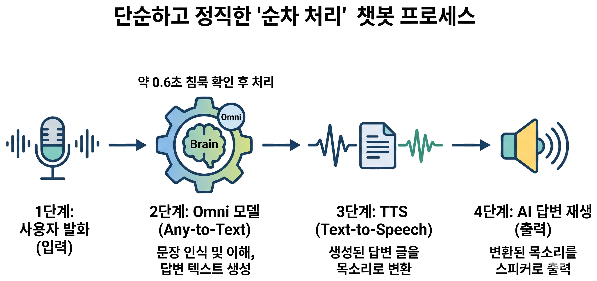
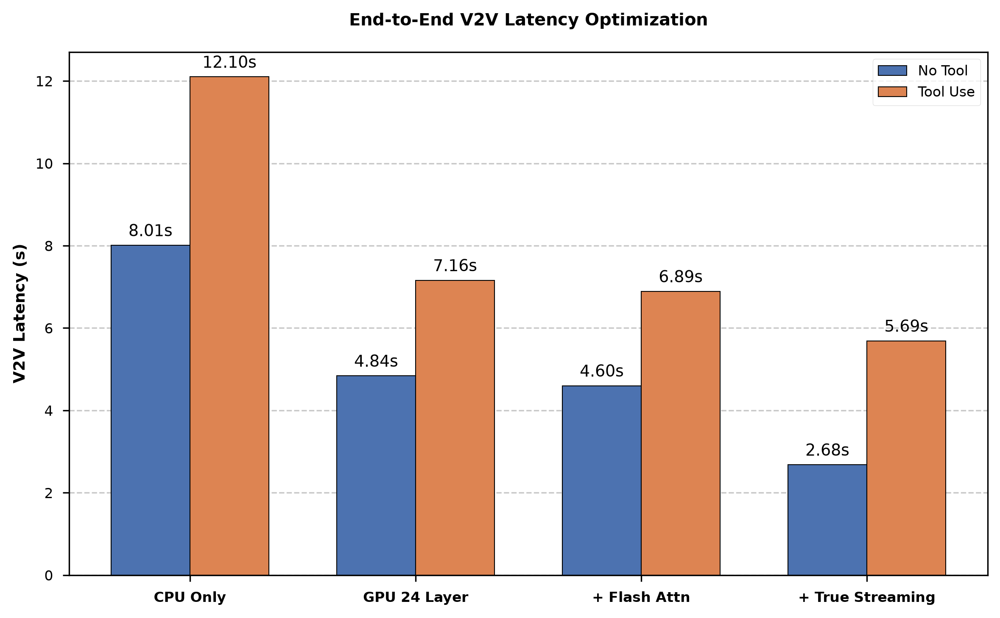

> **[`omni-iot` GitHub Project](https://github.com/htkim27/omni-iot)**
> Have you ever imagined an agent like Iron Man's Jarvis that lets you control devices around your home through natural conversation? I wanted to make that idea real by building a **two-way voice assistant that runs independently on an ordinary home computer, without relying on the external internet, and that anyone can freely customize.**

For a conversational voice agent, the time between the end of a user's utterance and the first audible word from the agent—voice response latency—determines whether the interaction feels natural. This post walks through how I reduced that delay on my home computer by tuning everything from hardware settings to the end-to-end dataflow architecture.

## A Silence Too Long to Feel Like Conversation

The first version used a simple sequential pipeline. After the user stopped speaking, it waited briefly—about 0.6 seconds—to confirm the end of the utterance. The language model then interpreted the request, generated the entire response, and passed the finished text to a text-to-speech engine for playback.

When I ran it, the result was surprisingly slow. It took **8 to 12 seconds** from the user's final word to the agent's first response. A ten-second silence makes anything resembling natural conversation nearly impossible, so I began tracing where the time was going and addressing each bottleneck in turn.

## 1. Use the GPU: “Was Everything Running on the CPU?”

The first thing I checked was whether the system was using the available hardware effectively. Because the language model was large, I used `llama.cpp`, which makes it practical to split memory use and run models on consumer hardware. I quickly found a major mistake in the serving configuration: **the base model was not using the GPU for parallel computation at all. It was running entirely on the CPU.** With the CPU carrying the whole workload, even a plain conversation took **8.01 seconds**, while a request involving tool use—such as turning a light on or off—took **12.10 seconds**.

I changed the configuration to offload a substantial portion of the work to the GPU. My graphics card has 16 GB of VRAM, which was not enough to hold the full model, so I gradually increased the offload while looking for the highest stable setting without out-of-memory errors. The best compromise was to place 24 of the model's 48 layers on the GPU.

Increasing GPU usage improved performance immediately. Plain conversation dropped from 8.01 to **4.84 seconds**, roughly a 40% reduction, and tool use fell from 12.10 to **7.16 seconds**, about 41% faster.

If local model inference feels unusually slow, the first check should be whether the GPU is actually doing useful work. Finding the best allocation that fits within the machine's memory limits is the foundation of latency optimization.

## 2. The Acceleration Trap: “There Is No Universal Cheat Code”

Flash Attention is one of the most commonly recommended ways to accelerate language models. It reduces I/O bottlenecks by moving data more efficiently through GPU memory during attention computation. Since it could be enabled with a single argument, I expected a significant improvement. The actual result was modest: plain conversation improved from 4.84 to **4.60 seconds**, about 5%, while tool use decreased from 7.16 to **6.89 seconds**, about 4%.

The reason was architectural. In a partially offloaded setup split between CPU and GPU, attention computation was not the dominant constraint. The narrow PCIe path carrying data between the CPU and graphics card was. When that transfer channel is already saturated, making the computation itself slightly faster barely changes end-to-end latency.

Inference optimizations can also trade answer quality for speed. This experiment reinforced a practical lesson: understand how an optimization works and verify that it addresses the **actual bottleneck in the current system** before enabling it simply because it is popular.

## 3. Change the Architecture: “Speak While You Write”

In the original pipeline, the text-to-speech engine sat idle until the language model had finished writing the entire response. Only then did it begin generating audio. That unnecessary wait led to the next change: a **streaming, concurrent pipeline**.

1. **Segment text as it streams.** As the language model generates tokens, send a phrase downstream as soon as it reaches a natural semantic boundary such as a comma or period.
2. **Generate speech concurrently.** The speech engine no longer waits for the complete response; it immediately synthesizes the short phrase it just received.
3. **Play audio as soon as it exists.** Playback begins the moment the first audio chunk is ready.

While the user hears the first phrase—“Sure, I can do that”—the language model is generating the next sentence and the speech engine is continuously converting it to audio in the background. The listening time itself becomes useful processing time, maintaining a natural flow without gaps.

This brought no-tool latency from 4.60 to **2.68 seconds**, a 41.7% reduction. With tool use, latency dropped from 6.89 to **5.69 seconds**, or 17.4%.

The perceived wait had finally entered the two-second range where human conversation begins to feel natural. More importantly, the result showed that optimizing the entire pipeline—the agent harness that moves data among models and surrounding systems—can matter more than squeezing additional compute speed from any individual model.

## Conclusion: Finding the Right Balance Under Resource Constraints

Building an agent system without access to expensive parallel compute or abundant cloud infrastructure is always challenging. But even on an ordinary machine with 16 GB of VRAM, accurately identifying the problem made meaningful improvements possible.

1. **Verify the hardware basics.** When inference is slow, monitor whether the GPU is doing its share and find the best CPU/GPU allocation within the available memory.
2. **Identify the real bottleneck.** A popular optimization is ineffective when it does not match the system's limiting factor.
3. **Design an efficient data pipeline.** The answer is not always faster model computation. Finding opportunities permitted by the user experience and restructuring dataflow around them can produce the largest practical gain.

**Next...**

The pipeline reduced a 12-second silence to the two-second range, but an interesting problem remains. When controlling a device, the current agent waits until the tool has finished executing before it begins to answer, leaving a delay of more than five seconds.

The next step is to make the interaction responsive even during tool execution—for example, having the agent immediately say, “Sure, I'm turning on the light now.” By coupling the system's processing flow more closely with its conversational behavior, the goal is to bring perceived latency into the **one-second range**.
