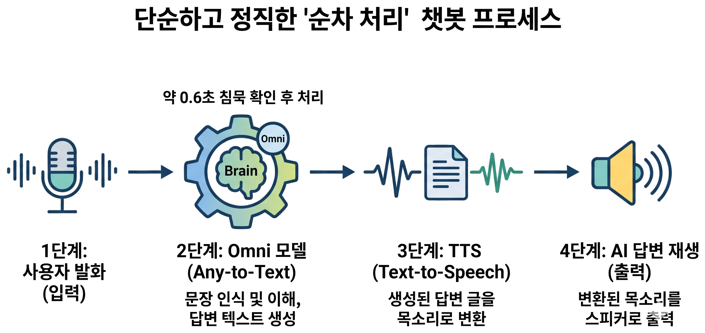
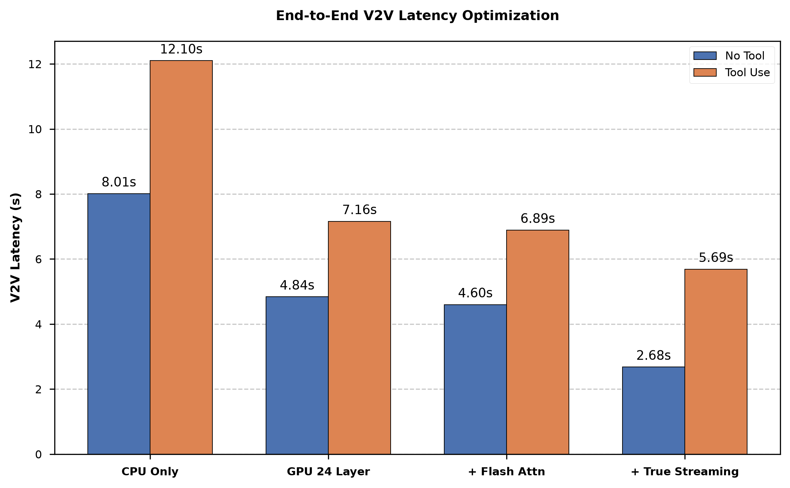

> **[`omni-iot` GitHub Project](https://github.com/htkim27/omni-iot)**
> Have you ever imagined an agent like Iron Man's Jarvis that lets you control devices around your home through natural conversation? I wanted to make that idea real by building a **two-way voice assistant that runs independently on an ordinary home computer, without relying on the external internet, and that anyone can freely customize.**

For a conversational voice agent, the time between the end of a user's utterance and the first audible word from the agent—voice response latency—determines whether the interaction feels natural. This post walks through how I reduced that delay on my home computer by tuning everything from hardware settings to the end-to-end dataflow architecture.

## A Silence Too Long to Feel Like Conversation

The first version used a simple sequential pipeline. After the user stopped speaking, it waited briefly (about 0.6 seconds) to confirm the end of the utterance. The language model then interpreted the request, generated the entire response, and passed the finished text to a text-to-speech engine for playback.

When I ran it, the result was surprisingly slow. It took **8 to 12 seconds** from the user's final word to the agent's first response. A ten-second silence makes anything resembling natural conversation nearly impossible, so I began tracing where the time was going and addressing each bottleneck in turn.

## 1. Use the GPU: “Was Everything Running on the CPU?”

The first thing I checked was whether the system was using the available hardware effectively. Because the language model was large, I used `llama.cpp`, which makes it practical to split memory use and run models on consumer hardware. I quickly found a major mistake in the serving configuration: **the base model was not using the GPU for parallel computation at all. It was running entirely on the CPU.** With the CPU carrying the whole workload, even a plain conversation took **8.01 seconds**, while a request involving tool use—such as turning a light on or off—took **12.10 seconds**.

I changed the configuration to offload a substantial portion of the work to the GPU. Since my 16 GB VRAM graphics card was not enough to hold the full model, I gradually increased the offload amount to find the highest stable setting without out-of-memory (OOM) errors. The best compromise was to place exactly half of the 48 layers (24 layers) on the GPU.

Increasing GPU usage improved performance immediately. Plain conversation dropped from 8.01 to **4.84 seconds** (about a 40% reduction), and tool use fell from 12.10 to **7.16 seconds** (about 41% faster).

If local model inference feels unusually slow, the first check should be **whether the GPU is actually doing its share of the work**. Finding the best allocation that fits within your computer's memory limits is the first step of latency optimization.

## 2. The Acceleration Trap: “There Is No Universal Cheat Code”

Flash Attention is one of the most commonly recommended ways to accelerate language models. It reduces I/O bottlenecks by moving data more efficiently through GPU memory during attention computation. Since it could be enabled with a single argument, I expected a significant improvement. However, the actual result was modest: plain conversation improved from 4.84 to **4.60 seconds** (about 5%), while tool use decreased from 7.16 to **6.89 seconds** (about 4%).

Why? In a partially offloaded environment split between CPU and GPU, the dominant constraint wasn't the attention computation speed, but rather the narrow PCIe bandwidth transferring data between the CPU and graphics card. When that transfer channel is already saturated, making the computation itself slightly faster barely changes the overall end-to-end latency.

Inference optimizations can also trade answer quality for speed. This experiment reinforced a practical lesson: rather than blindly enabling popular optimizations, you must understand how they work and verify whether they address the **actual bottleneck in your current system**.

## 3. Change the Architecture: “Speak While You Write”

In the original pipeline, the text-to-speech (TTS) engine sat idle until the language model had finished writing the entire long response. Only then did it begin generating audio, which inevitably took a long time. The solution to this was a **real-time concurrent pipeline**.

1. **Segment text as it streams**: As the language model generates tokens character by character, we send a phrase to the next step as soon as it reaches a natural semantic boundary like a comma (,) or period (.).
2. **Generate speech concurrently**: The speech engine no longer waits for the complete sentence; it immediately synthesizes audio data using just the short phrase it received.
3. **Play audio as soon as it exists**: Playback through the speaker begins the moment the first audio chunk is ready.

Thanks to this, while the user hears the first phrase ("Sure, I can do that"), the language model is generating the next sentence and the speech engine is continuously converting it to audio in the background. By utilizing the time the user spends listening to prepare the next part of the conversation, it maintains a seamless natural flow. As a result, no-tool latency dropped from 4.60 to **2.68 seconds** (about a 41.7% reduction), and tool use latency dropped from 6.89 to **5.69 seconds** (about 17.4%).

The perceived wait had finally entered the two-second range, where natural human conversation becomes possible. I realized how much more important it is to **optimize the overall pipeline (agent harness) architecture so that the model and surrounding systems stream data smoothly**, rather than just squeezing out computation speed from individual models.

## Conclusion: Finding the Right Balance Under Resource Constraints

Building an agent system without access to expensive parallel compute or abundant cloud infrastructure is always a challenging endeavor. But even on an ordinary machine with 16 GB of RAM, accurately identifying the problems made it possible to find sufficient solutions.

1. **Verify the hardware basics**: When things are slow, monitoring whether the graphics card is doing its job and finding the best distribution within memory limits is fundamental.
2. **Identify the real bottleneck**: Popular optimization techniques can be useless if they don't match the system's true bottleneck.
3. **Design an efficient data pipeline**: The key to overcoming system limits isn't just accelerating individual model computations. The most effective performance improvement can come from capturing opportunities allowed by the user experience (UX) and optimizing the data flow pipeline accordingly.

**Next...**

We reduced a 12-second silence to the 2-second range, but an interesting problem remains. In the current architecture, when controlling a home device, the agent waits until the tool has finished executing before it begins to answer, leaving a latency of over 5 seconds.

The next step to solve this is integrating an interactive approach where the agent can immediately respond with something like "Sure, I'm turning on the light now!" even while executing the tool. By interlocking the system's processing flow more organically with the conversational flow, pulling the perceived latency down to the **one-second range** is our core upcoming challenge.
