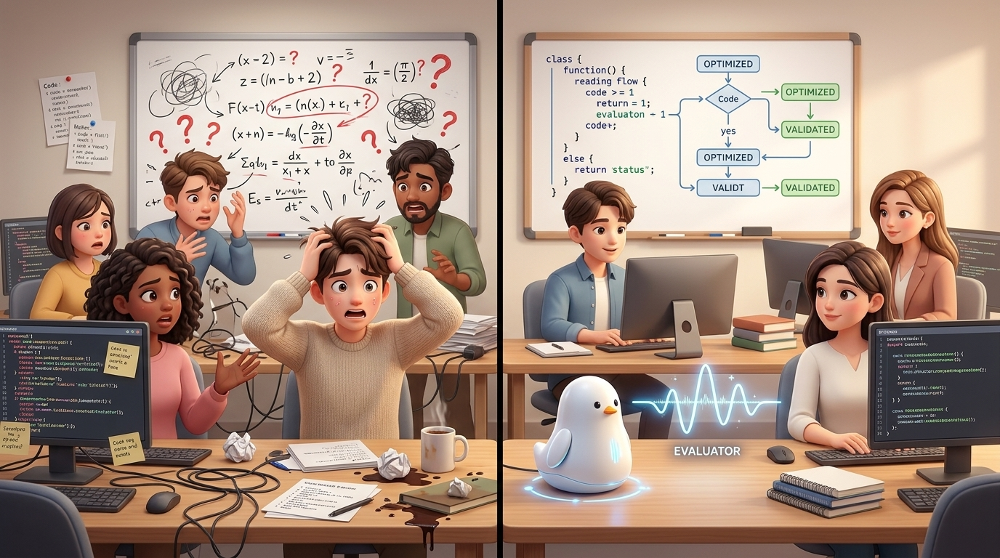
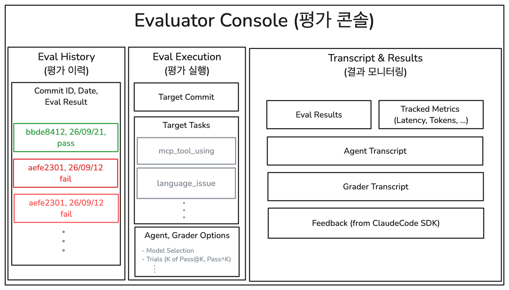

## 1. 평가 시스템의 필요성을 깨달은 계기

올해 3월부터 도메인에 특화된 AI 에이전트 서비스를 개발하고 있다. 형태를 비유하자면 일종의 '도메인 특화 코파일럿'이다. 유저가 직접 작업할 수 있는 워크스페이스와 가상 파일 시스템이 마련되어 있고, 채팅 인터페이스를 통해 에이전트가 코드를 작성·편집하고 파일 시스템에 접근해 도구를 실행하며 유저와 함께 업무를 완성해 나가는 구조다. 

단순한 챗봇이 아니다. While-loop 기반의 자율적 도구 호출은 물론, 극한의 멀티턴(multi-turn) 환경에서도 컨텍스트 윈도우가 터지지 않도록 지탱하는 하네스(Harness), 그리고 정교하게 다듬어진 도메인 지식 온톨로지가 MCP를 통해 결합된 꽤 묵직한 에이전트 시스템이다.

이 프로젝트를 킥오프할 당시, 나는 팀에 한 가지를 강하게 주장했다. **"우리 팀에 반드시 '에이전트 평가 시스템'를 전담으로 구축하는 롤이 있어야 합니다."**

그 무렵 팀 내에서는 이른바 '바이브 코딩(Vibe Coding)'이 개발 워크플로우에 본격적으로 자리 잡기 시작했다. LLM의 보조를 받으면서 1인 개발자의 기능 구현 속도가 3배, 5배로 폭발하던 시기였다. 하지만 나는 바로 그 지점에서 위험 신호를 느꼈다. 개발 속도가 빨라졌다고 해서 그 리소스를 또 다른 기능 개발에 고스란히 쏟아붓는다면, 그것은 **안갯속에서 가속 페달만 더 세게 밟는 꼴**이 될 것이 뻔했다. 빨라진 속도만큼 버그와 사이드 이펙트를 양산하는 속도도 빨라질 테니까. 

늘어난 개발 잉여 리소스는 추가 기능이 아니라, 논리적인 의사결정과 '안정적으로 우상향하는 연구 개발'을 담보해 줄 **평가 시스템(Evaluator)**에 투입되어야만 했다.

내가 이렇게까지 평가 시스템에 집착했던 이유는 명확했다. 입사 후 약 2년 동안 경험했던 선행 프로젝트에서 평가 시스템 부재가 불러온 런칭 지연의 악몽을 겪었기 때문이다.

현재 개발 중인 서비스의 직전 세대에 해당하는 선행 솔루션이 있었다. 랭그래프(LangGraph) 기반의 결정론적(deterministic) 스캐폴딩 구조 위에, 수백 번의 Multi-LLM 호출을 병렬 및 순차적으로 연결한 파이프라인이었다. 한 번 파이프라인이 돌면 약 1시간에서 2시간 동안 딥한 추론을 수행하여, 현업의 복잡한 의사결정에 필요한 핵심 단서들을 분석해 주는 일종의 에이전틱 AI(Agentic AI) 서비스였다.

당시 우리 팀은 극도로 애자일하게 움직였다. 기능을 새로 하나 만들거나, 혹은 A·B·C·D 여러 버전으로 가설을 구현하면 즉시 현업 알파 테스터들에게 전달해 정성적인 평가를 맡겼다. 

개발 초중반에는 이 방식이 더없이 이상적이고 기민한 워크플로우처럼 보였다. "와, 이번 버전 정말 좋아졌네요!"라며 현업의 피드백이 실시간으로 돌아왔고, 주변 다른 개발팀에서도 "우리도 저런 방식으로 R&D를 굴려야 한다"는 말들이 오갔다.

그러나 문제는 알파 테스트 이후 진행된 '베타 테스트'에서 가시화되었다.

어느 날부터 테스터들 입에서 불만 섞인 피드백이 나오기 시작했다. *"뭔가 이상해졌다.", "지난번보다 성능이 저하된 것 같다."* 

초기에는 관성적으로 대응했다. 요청 사항에 맞춰 프롬프트를 조금 손보고, 스캐폴딩 로직에 조건문 몇 개를 덧대어 다시 빌드를 보냈다. 하지만 이 땜질식 작업은 장장 2~3개월 동안 끝없이 이어졌다.

우리가 수정을 해서 보내면 테스터들은 고개를 갸웃거렸다. 
> *"우리가 의도한 건 이런 출력이 아니에요."*  
> *"그 부분은 고쳐졌는데, 원래 잘 되던 저쪽 분석이 갑자기 안 나오는데요?"*

하나를 고치면 다른 하나가 깨지는 트레이드오프(Trade-off)가 꼬리를 물었다. 수백 개의 LLM 추론 노드가 복잡하게 얽혀 있는 상황에서, 우리는 시스템의 어디가 병목이고 무엇이 진짜 원인인지 전혀 짚어내지 못하고 있었다. 명확한 원인 파악 없이 방법론을 적용한 뒤, 테스터들의 피드백에만 의존해 결과를 확인해야 했다.

더 큰 문제는 **테스터들의 신뢰도 하락**이었다. 실망스러운 피드백 루프가 몇 주간 반복되자 테스터들의 시선은 극도로 방어적이고 부정적으로 변했다. 기존에 존재하던 엣지케이스 에러조차 *"새로 발생한 버그"*로 인식하여 보고하는 경우가 늘어났다. 객관적인 지표가 없으니 이를 검증할 근거도 부족했다.

그 시점에는 이미 평가 시스템을 새로 구축할 수 있는 타이밍이 한참 지나 있었다. 당장 "다음 주 런칭"이라는 일정이 박혀 있는 상황에서, 며칠씩 걸려 평가 파이프라인을 짜자는 제안은 팀 내에서 현실적으로 도입하기 어려웠다. 

결국 단기적인 문제 해결에만 집중하며 일정이 지속적으로 연기되었다. 이후 프로덕션을 런칭했으나, 당시 발생한 기술 부채는 라이브 환경에서 여러 문제를 일으키며 유지보수 리소스를 소모하고 있다.

그때 절감했다. **평가 시스템이 없는 에이전트 개발은 방향성 없이 리소스만 투입하는 것과 같다.** 목표 지점이 어디인지, 현재 상태를 객관적으로 측정하지 못하는 개발 프로세스는 결국 프로젝트 전체의 리스크로 작용한다.

---

## 2. 실무에서 탑다운(Top-Down) 평가 방식이 실패하는 시나리오

새로운 에이전트 프로젝트가 시작되었을 때, 나는 이번 프로젝트에서는 시작 단계부터 평가 시스템을 구축하기로 계획했다.

나의 직급은 제일 낮지만, 팀에서 세 번째로 오래 머물며 프로젝트에 주도적으로 참여해온 경험 덕분에 팀장님과 리드님으로부터 초기 0to1 PoC에 대한 상당한 자율성을 인정받고 있었다. 초기에 배정된 인원은 나를 포함해 총 3명(나, 동료 연구원 1명, 학부 인턴 연구원 1명). 

나는 과감하게 자원을 배분했다. UI 디자인, 백엔드 인프라, 에이전트 런타임 하네스 구축 등 핵심 개발은 나 혼자 전담하고, 동료 연구원과 인턴 연구원 2명을 전적으로 '평가 시스템 구축'에 투입했다. 3명 중 2명을 평가에 쓴 셈이다. 이는 평가 기반의 연구 개발 체계를 조기에 정착시키기 위한 결정이었다.

그러나 그 원대한 포부는 **한 달을 넘기지 못하고 중단되었다.** 세 명 모두 기능 개발로 재배치되어야 했다.

이유는 단순했다. **한 달 동안 평가 시스템 쪽에서 실질적인 성과가 전혀 나오지 않았기 때문이다.**

돌아보면 실패의 원인은 명확했다. 우리는 '학술적 완벽주의'의 늪에 빠져 실무와 동떨어진 지표 설계의 한계를 드러내고 있었다. 우리 중 누구도 '현업 프로덕션 에이전트를 어떻게 평가해야 하는가'에 대한 실무 노하우가 없었다. 그렇다 보니 자연스럽게 대학원이나 연구실에서 하던 방식, 즉 **전통적인 '탑다운(Top-Down)' 방식**으로 평가 시스템에 접근한 것이 화근이었다.

우리가 만드는 서비스는 수많은 중간 산출물들이 조합되어 최종 결과물을 도출하는 복합 에이전트였다. 우리는 너무나 모범생처럼 접근했다.
1. **오픈 벤치마크 탐색**: 세상에 존재하는 최신 LLM 에이전트 벤치마크 논문들을 샅샅이 뒤졌다. 인턴 연구원이 수많은 레퍼런스를 탐색했지만, 도메인 특화 태스크의 특성상 우리 프로덕션의 실제 목표와 맞아떨어지는 벤치마크는 단 하나도 없었다.
2. **복잡한 지표와 루브릭 설계**: 결국 LLM-as-a-judge 방식을 도입하기로 하고, 학술적인 평가 루브릭을 도메인에 맞게 커스텀하기 시작했다. 그리고 그 루브릭이 믿을 만한지 검증하겠다며 내부 연구원들이 달라붙어 점수 칼리브레이션(Calibration) 작업을 진행했다. 이것만으로도 한 달이 훌쩍 지나갔다.
3. **끝없는 엑스트라 워크(Extra-work)**: 여기서 끝이 아니었다. 지표의 신뢰성을 확보하기 위해 평가 데이터셋을 합성·증강해야 했고, 현업 테스터와의 상관관계(Human correlation)까지 측정해야 한다는 연구 계획서가 작성되었다.

그 계획서를 팀에 공유했을 때 돌아온 피드백은 회의적이었다.
> *"평가 시스템이 있으면 좋다는 건 알겠는데... 당장 기능 구현하기도 바쁜데 현재 상황에서 그렇게까지 리소스를 써야 하나요?"*

현업뿐만 아니라 나 스스로도 회의감이 들기 시작했다. 화면에 보이지 않는 거대한 평가 인프라를 만드느라 정작 프로덕션 에이전트의 개발 속도는 지연되고 있었다. 나 혼자서는 복잡하고 까다로운 도메인 요구사항들을 에이전트 프레임워크에 제때 이식해 낼 한계가 있었다. 팀 내부에서도 프로덕트의 진척에 대한 우려가 커졌다.

결국 우리는 평가 시스템 개발을 전면 보류하고, 3명 모두를 MVP 연구 개발에 긴급 투입했다. 평가 시스템 구축보다 생존이 먼저인 현실 속에서 MVP 개발로 선회한 것이다.

돌이켜보면, 당시 평가 시스템 개발을 멈춘 것은 결과적으로 **타당한 결정**이었다.

우리는 에이전트 시스템 자체에 대해 너무 무지했다. 실전 경험도 없는 상태에서 교과서적인 벤치마크 방법론을 흉내 내려다 리소스의 한계에 부딪혔다. 게다가 대다수 기업의 엔지니어링 조직에서 '보이지 않는 인프라'를 마냥 기다려줄 수 있는 시간은 그리 길지 않다. 빅테크처럼 리소스가 무한하고 장기 R&D 체계가 잡힌 곳이 아니라면, 두세 달 안에 실체 있는 결과물(MVP)로 가능성을 입증하지 못하는 과제는 중단될 가능성이 높다. 

우선 살아남아야 했다. 우리는 평가 시스템을 서랍 속에 봉인해 둔 채, MVP 개발에 집중했다.

물론 쓸만한 에이전트 프로덕트를 만드는 길 역시 쉽지 않았다. 플래그십 LLM SDK를 가져와 While-loop에 도구 몇 개 쥐여준다고 끝날 문제가 아니었다. 기능을 추가할 때마다 컨텍스트는 폭발했고, 프롬프트 엔지니어링, 컨텍스트 엔지니어링, 도메인 온톨로지 적용, 비인가 데이터 유출 방지 등 고려해야 할 복잡도가 크게 증가했다. 

중간에 "이 구조로는 도저히 감당이 안 된다" 싶어 애써 짠 코드들을 통째로 밀어버리고 뼈대만 남긴 채 바닥부터 다시 짠 적도 있었다. 다행히 과제 기술 리드를 다시 맡아주신 테크리드님, 그리고 궂은 연구 과제를 묵묵히 풀어내 준 5년 선배 사수 엔지니어의 합류 덕분에, 우리는 4~5개월 만에 현업에 시연할 수 있는 견고한 MVP를 세상에 내놓을 수 있었다.

---

## 3. 전환점: 실무 에이전트 평가를 위한 4가지 설계 철학

다행이 배포된 MVP는 테스터들로부터 긍정적인 전망을 인정 받고 정식 과제 절차에 돌입했다. 현재는 대상을 넓혀 추가 BPO 인원을 모집하고 정식 FGI(포커스 그룹 인터뷰)를 준비하고 있다.

어느 정도 한숨을 돌린 시점, 팀 내에서 MVP 개발 회고(Post-mortem) 자리가 열렸다. 지금까지의 개발 성과를 돌아보고, 이 프로덕트를 진짜 상용 서비스로 스케일업하려면 무엇이 필요한지 자유롭게 논의하는 시간이었다.

그 자리에서 테크리드께서 먼저 화두를 던져주셨다.
> **"이제 서비스의 '하한선(Floor)'을 방어해야 할 때입니다. 품질이 특정 수준 이하로 떨어지지 않도록 지탱해 줄 평가 체계라는 가드레일이 반드시 필요합니다."**

핵심을 짚는 통찰이었다. 과거의 런칭 연기 트라우마, 그리고 1차 시도에서 실패했던 평가 시스템의 아쉬움이 순식간에 교차했다. 감사하게도, 다시 한번 내게 '평가 시스템 구축'이라는 중책이 맡겨졌다.

그 무렵 나는 매일 혹은 격일 단위로 공개되는 [앤트로픽 엔지니어링 블로그(Anthropic Engineering)](https://www.anthropic.com/engineering)의 아티클들을 탐독하며 인사이트를 팀 단톡방에 꾸준히 공유하고 있었다. 실전 에이전트를 프로덕션 레벨로 올리기 위해 그들이 어떤 시행착오를 겪었고, 하네스를 어떻게 설계했으며, 어떤 엔지니어링 철학으로 모델을 다루는지가 놀라울 만큼 투명하고 명쾌하게 적혀 있는 글들이었다.

특히 평가(Evaluation)에 대해 종합적으로 정리해 놓은 포스트를 읽었을 때의 인상 깊었다. 현장에서 겪은 파편화된 암묵지들이 명확한 언어로 구조화되어 있었기 때문이다.

> **"평가 시스템은 가치 투자와 같다. 일찍 시작할수록 복리로 이득을 얻고, 늦게 시작할수록 그만큼 대가를 치러야 한다."**

평가 시스템을 왜 진작 만들지 못했는지에 대한 지난날의 후회와, 현업의 압박 속에서 개발팀이 평가 시스템을 망설일 수밖에 없는 현실적인 고뇌를 그들은 너무나 완벽하게 이해하고 있었다. 그러면서도 왜 지금 당장 만들어야만 하는지를 반박할 수 없는 논리로 설득하고 있었다.

그 통찰과 우리 팀의 뼈아픈 실패 경험을 거울삼아, 나는 초기 평가 시스템을 지탱할 **4가지 핵심 설계 철학**을 정립했다.

---

### ① 평가는 거창한 연구가 아니다: 요구사항(Requirements) 중심의 실용적 검증
첫 번째 시도가 실패했던 이유는 '완벽한 일반화 벤치마크'를 만들려 했기 때문이다. 현업 프로덕션에서 평가의 본질은 단순하고 실용적이다. **"이 시스템을 쓸 유저가 실제로 요구한 스펙을 에이전트가 만족하는가?"**를 기계적으로 검증할 수만 있다면 그것이 곧 훌륭한 평가 시스템이다.

학술적 메트릭을 고민하느라 시간을 허비하지 말고, 당장 이번 스프린트에 떨어진 유저 요구사항 하나(예: "파일 저장 시 특정 포맷을 준수해야 한다", "조회 권한이 없는 문서는 열람을 거부해야 한다")를 검증하는 가장 단순한 assert문과 프롬프트 루브릭부터 시작해야 한다. 실무에서의 평가는 탑다운의 학술 연구가 아니라, 철저히 바텀업(Bottom-up)의 실용적 엔지니어링이어야 한다.

### ② 평가는 가장 구체적인 '방향성 합의'이자 커뮤니케이션 도구다
개발을 하다 보면 기획자, 개발자, 테스터가 같은 단어를 쓰면서도 완전히 다른 그림을 그리는 '동상이몽'이 일상적으로 발생한다. "한국어 응답을 자연스럽게 해주세요"라는 요청에 대해 각자가 생각하는 '자연스러움'의 기준은 천차만별이다.

기능을 개발하기 전, "우리가 통과시켜야 할 평가 루브릭과 성공 기준(Success Criteria)이 이것이다"라고 명문화하는 순간, 협업 당사자 간의 불필요한 인지적 오차가 사라진다. 평가는 사후 검증 도구가 아니라, **우리가 도달해야 할 목적지의 좌표를 일치시키는 가장 정밀한 사전 커뮤니케이션 도구**다.

### ③ 평가 시스템의 신뢰성(Silver Level)은 트랜스크립트 모니터링에서 나온다
많은 이들이 평가 시스템을 만들 때 '숫자로 떨어지는 점수(Score)'에 집착한다. 하지만 에이전트 시스템에서 단순한 종합 점수(예: 85점)는 아무런 실무적 통찰을 주지 못한다.

신뢰할 수 있는 평가 시스템이 되려면, 에이전트가 문제를 해결해 나간 사고 과정(Chain-of-Thought)과 도구 호출 내역, 그리고 이를 채점한 평가 시스템의 근거가 일목요연한 **트랜스크립트(Transcript) 로그** 형태로 남아야 한다. 
개발자는 초기 단계에서 이 트랜스크립트를 직접 눈으로 확인하며 두 가지를 지속적으로 조정(Calibration)해야 한다:
1. *평가 시스템이 개발자의 의도에 맞게 정확한 지점에서 올바른 잣대로 판정을 내렸는가?*
2. *에이전트가 점수만 잘 받고 실제로는 엉뚱한 편법(Hacking)을 쓰지는 않았는가?*  
이 모니터링 루프가 돌아야만 비로소 팀 전체가 믿고 기댈 수 있는 '실버 레벨(Silver-level)'의 신뢰성이 확보된다.

### ④ 평가 시스템은 회귀(Regression)를 막는 최고의 자동화 방어선이다
새로운 기능을 추가할 때 기존 기능이 망가지는 트레이드오프(Regression)는 LLM 에이전트 개발의 가장 큰 적이다. 하지만 한 번 정교하게 작성된 평가 케이스는 휘발되지 않는다. 그것은 고스란히 다음 버전의 배포 안정성을 지켜주는 **'회귀 방지 테스트 스위트'**로 영구 축적된다.

개발이 진행될수록 평가 항목은 누적되고, 이는 배포 전 잠재적 장애를 사전에 걸러내는 가장 강력한 자동화 QA 망이 된다.  
이것은 학창 시절 **방학 숙제 일기**와 같다. 매일 한 편씩 써두면 개학 전날 아무런 걱정이 없지만, 미루고 미루다 8월 31일 밤에 30일 치 일기를 한꺼번에 쓰려고 하면 날씨조차 기억나지 않아 지어내야 하는 문제가 발생한다. 평가 시스템을 매일 조금씩 쌓아가는 일은, 런칭 직전의 리소스 낭비와 임시방편적인 대응을 막아주는 핵심적인 예방책이다.

---
## 4. 실무 하네스 구축: 가시성 높은 평가 시스템 콘솔 설계

앞서 세운 4가지 철학을 현실의 소프트웨어로 구현하기 위해, 우리는 에이전트 평가를 실행·관찰·분석할 수 있는 전용 **평가 시스템 콘솔(Evaluator Console)**을 설계하고 구축했다.

> **에이전트 평가 시스템 콘솔 구성**: 좌측(평가 히스토리: 시간축에 따른 종합 성적 추이), 중앙(평가 실행: 백본 모델, 타겟 태스크, 반복 시행 횟수 등 가변 인자 설정), 우측(평가 모니터링: 전체 메트릭 요약 및 태스크·시행별 렌더링된 트랜스크립트와 그레이더 근거 분석).

내가 콘솔 개발에 가장 먼저 집중한 이유는 명확했다. **터미널 CLI와 복잡한 JSON 파일로만 남는 평가 시스템은 에이전트에겐 친화적일지 몰라도, 사람에게는 전혀 친화적이지 않다.** 

엔지니어가 결과를 직관적으로 한눈에 읽고, 이상 징후를 클릭 몇 번으로 드릴다운(drill-down)할 수 없다면, 매일 기능 개발에 쫓기는 동료들에게 평가는 또 하나의 추가적인 부담으로 인식되기 쉽다. 평가가 팀 전체의 프로토콜이자 합의의 도구로 자리 잡으려면, **눈에 보이고 분석하기 쉬운 가시성**이 필수적이었다.

### ① 버전 애그노스틱(Version-Agnostic)과 완벽한 재현성

하네스를 설계할 때 가장 주의했던 것은 "에이전트 코드가 조금만 리팩토링되어도 평가 시스템이 깨지는 결합도"였다.

1. **Git Commit 기반의 재현성**:  
   평가 대상 코드의 버저닝을 엄격히 관리하기 위해, 에이전트 서비스 리포지토리의 Git 커밋 해시(Commit ID)를 기반으로 특정 시점의 에이전트 런타임을 즉시 체크아웃하고 완벽하게 재현(Reproduce)하여 테스트할 수 있도록 연동했다.
2. **블랙박스형 입출력 타겟팅**:  
   평가 시스템 코드는 앱 코드와 완전히 분리된 독립 리포지토리에서 관리된다. 이때 에이전트 내부의 지엽적인 중간 변수나 상태값을 하드코딩해서 파싱하는 방식은 배제했다. 평가 대상 데이터는 **1) 유저에게 UI로 최종 렌더링된 텍스트, 2) 파일 시스템에 최종 저장된 산출물 문서, 3) 전체 대화 및 도구 호출 궤적(Transcript)** 세 가지만을 타겟으로 삼았다. 서비스의 본질적인 방향성이 피벗되지 않는 한, 에이전트 내부 아키텍처가 바뀌어도 평가 스위트가 지속적으로 동작하도록 설계한 것이다.

### ② 평가 태스크의 구성: 환경(Environment)과 세 가지 채점기(Graders)

평가 태스크는 크게 에이전트가 놓일 **환경(Environment)**과 이를 채점하는 **그레이더(Grader)**로 나뉜다.

* **환경(Environment)**: 인풋 쿼리, 직전 멀티턴 대화 히스토리, 에이전트의 초기 메모리 및 파일 시스템 상태를 정의한다. 특히 실제 MVP 테스트 도중 BPO들이 겪었던 실패 환경을 1:1로 복제하거나, 이를 기반으로 더 가혹하고 다각적인 엣지 케이스로 증강(Augment)하여 데이터셋을 구성했다.
* **채점기(Grader)**: 에이전트의 복합적인 특성을 다루기 위해 단일 방식을 고집하지 않고 세 가지 방식을 조합했다:
  1. **LLM Assertion (제약조건 엄수)**: 명확하고 정교한 루브릭을 부여한 뒤, 필수 조건들이 **100% 모두 충족(All-Pass)**되었는지를 검증한다. (예: "지정된 파일 포맷을 준수했는가?", "접근 권한이 없는 데이터 조회를 거절했는가?")
  2. **LLM Scoring (품질 평가)**: 생성된 결과물의 다양성, 설명의 정밀도 등 주관성이 개입되는 정성적 퀄리티를 평가할 때 사용한다. 루브릭 기반으로 채점된 점수가 사전에 정의된 임계값(Threshold)을 넘어서는지로 합불(Pass/Fail)을 판정한다.
  3. **Deterministic Rule-based (결정론적 룰 검증)**: LLM 심사관의 한계를 보완하는 가장 확실한 안전망이다. 특정 도구 실행 시 예외(Exception)나 에러 코드가 발생했는지, 혹은 한국어 출력 중 비정상적인 특수 토큰이나 깨진 유니코드가 섞여 있는지를 정규표현식과 코드로 효율적으로 분류한다.

### ③ 트랜스크립트 렌더링과 채점기 캘리브레이션

콘솔의 우측 패널은 에이전트가 어떤 생각(Chain-of-Thought)을 거쳐 어떤 도구를 호출했는지, 그리고 채점기(Grader)는 **왜 그런 점수를 부여했는지에 대한 정당한 근거(Rationale)**를 마크다운으로 렌더링해 보여준다.

초기에 신뢰할 수 있는 평가 시스템을 만들기 위해서는 이 트랜스크립트를 직접 확인하며 개발자가 지속적으로 캘리브레이션(Calibration)을 진행해야 한다. 

단순히 채점기가 뱉어내는 '합격(Pass)'이나 '85점'이라는 결과값만 맹신해서는 안 된다. 채점기 역할을 하는 LLM 역시 환각(Hallucination)을 일으키거나, 주어진 루브릭을 개발자의 의도와 다르게 자의적으로 해석할 위험이 존재하기 때문이다. 개발자는 트랜스크립트를 눈으로 직접 쫓아가며 다음 두 가지를 끊임없이 교정해야 한다.

1. **채점기의 논리 검증**: 평가기가 우리가 설정한 루브릭에 맞춰 합리적인 근거로 일관된 판정을 내리고 있는가? 에이전트가 편법으로 정답을 맞혔는데 엉뚱한 이유로 합격(False Positive) 처리를 하지는 않았는가?
2. **기준의 정렬(Alignment)**: 평가기의 깐깐함이나 채점 기준이 현업 도메인 전문가(BPO)가 기대하는 정답(Golden Truth)과 일치하는가?

이러한 캘리브레이션 과정 없이 평가 시스템에 점수 판정을 맹목적으로 위임하는 것은, 또 다른 형태의 거대한 블랙박스를 만드는 것과 같다. 평가기의 신뢰 수준이 어느 정도인지 파악하지 못한 채 평가를 진행한다면 결국 과거처럼 '감에 의존하는 개발'을 벗어날 수 없다. 평가기의 눈높이를 사람의 기준에 정밀하게 맞추는 이 지루하고 치열한 조정 작업을 거쳐야만 비로소 팀 전체가 믿고 기댈 수 있는 굳건한 평가 인프라가 완성된다.

더 나아가 우리는 실패한 트랜스크립트 로그를 [Claude Code](https://docs.anthropic.com/en/docs/agents-and-tools/claude-code/overview)와 같은 플래그십 코딩 에이전트에 통째로 주입하여, 에이전트의 실패 원인 분석과 프롬프트/하네스 개선안을 자동으로 도출하는 피드백 루프까지 유기적으로 연결했다.

---

## 5. 실무에서 증명된 가치: 3가지 현장 디버깅 사례

평가 시스템 콘솔을 구축한 이후, 팀의 의사결정 방식은 극적으로 단단해졌다. 실무에서 겪었던 대표적인 3가지 사례가 이를 방증한다.

#### 사례 1: "그런 것 같다"에서 "이거다"로 — Claude 한국어 토큰 깨짐의 실체 규명
최근 Claude 5 (sonnet / opus) 모델이 도구 인자(Tool JSON Arguments)를 생성할 때 한국어를 유니코드 이스케이프(`\uXXXX`) 형태로 잘못 인코딩하면서, 16진수 값이 미세하게 어긋나 글자가 완전히 깨지는(예: `한국` → `한눍`) 치명적인 이슈가 커뮤니티와 깃허브에서 큰 화두였다.

커뮤니티에 널리 퍼진 통설은 *"시스템 프롬프트에 `\uXXXX` 대신 UTF-8 형식으로 출력하라는 지침을 넣으면 해결된다"*는 것이었다. 우리 팀도 MVP 당시 이 가설을 믿고 프롬프트를 땜질해 배포했었다. 하지만 현업에서는 여전히 간헐적으로 글자 깨짐 현상이 리포트되었다.

평가 시스템 콘솔이 완성된 후, 우리는 실제 실패 환경을 그대로 본뜬 평가 태스크를 등록했다. 현재 버전에서 여전히 Fail이 떴다. 프롬프트를 한층 더 엄격하게 다듬자 반환값에서 `\uXXXX`는 완전히 사라졌다. **그러나 놀랍게도 평가 시스템은 여전히 Fail을 뱉어냈다.** 

트랜스크립트와 Rule-based 채점기 로그를 정밀 분석해 보니, UTF-8로 인코딩된 상태에서도 모델 자체의 디코딩 메커니즘 문제로 동일한 형태의 토큰 뭉개짐이 발생하고 있었다. 커뮤니티의 가설이 절반만 맞았던 것이다.

원인이 명백해지자 의사결정도 명쾌해졌다. 더 이상 프롬프트에 프롬프트를 과도하게 수정하는 작업을 중단했다. 대신 **"해당 도구 호출 단계에 한해 백본 모델을 Gemini나 GPT 등 다른 모델로 잠시 스위칭한다"**는 확실하고 논리적인 아키텍처 우회책을 확정했다. 평가 시스템이 없었다면 우리는 또다시 프롬프트 튜닝의 반복적인 수정 작업에 시간을 허비했을 것이다.

#### 사례 2: 조기 발견과 기민한 협업 — MCP 서버 도구 디스크립션 버그
우리는 데이터 트윈(온톨로지) 플랫폼 위에 [MCP(Model Context Protocol)](https://modelcontextprotocol.io/) 서버를 올리고, 에이전트가 이를 도구로 호출하는 기능을 구축하고 있었다. MCP 서버 개발은 나와 다른 엔지니어분들이 분담하고 있었다.

평가 시스템에는 *"특정 업무 쿼리가 들어왔을 때 지정된 MCP 도구를 반드시 호출해야 한다"*는 라벨링 태스크를 등록해 두었다. 그런데 잘 동작하던 도구 라우팅이 특정 쿼리에서 지속적으로 실패했다.

트랜스크립트를 열어 에이전트의 도구 라우팅 추론 과정을 확인했다. 원인은 다른 곳에 있었다. 협업 팀이 작성한 MCP 도구의 Description에 *"OO가 쿼리에 포함되었을 때만 사용"*이라는 과도하게 제한적인 제약조건이 기재되어 있었던 것이다. 에이전트는 도구의 설명 문구만을 보고 "OO이 없으니 쓰면 안 되겠구나"라고 지극히 논리적인 거부를 하고 있었다.

에이전트의 추론 궤적이 고스란히 담긴 트랜스크립트 덕분에, 우리는 의심이나 감정 소모 없이 MCP 엔지니어분들께 버그의 정확한 위치를 공유할 수 있었고, 빠르게 문제를 해결할 수 있었다.

#### 사례 3: 회귀(Regression)의 완전 자동 차단 — '기도 메타'의 종말
에이전트의 런타임 하네스는 프롬프트, 도구 스키마, 훅(Hooks), 컨텍스트 파이프라인 등이 거미줄처럼 유기적으로 얽혀 있다. 기능을 하나 추가할 때 기존 기능이 망가지는 회귀(Regression)는 피할 수 없는 숙명이다.

이제 우리는 해결된 모든 이슈(한국어 인코딩, MCP 도구 라우팅, 파일 포맷팅 등)를 평가 시스템의 **'회귀 방지(Regression) 스위트'**로 영구 등록한다. 새로운 기능을 추가하고 빌드를 올릴 때, 엔지니어는 콘솔에서 회귀 스위트를 한 번 클릭하기만 하면 된다. 

코드를 배포해 놓고 테스터가 "이거 또 안 되는데요?"라고 리포트할 때까지 결과를 운에 맡기던 불확실한 배포 과정은 이제 안정적인 자동화 테스트로 대체되었다.

---

## 6. 결론: '방학 숙제 일기'처럼 매일 평가 케이스를 쌓아야 하는 이유

평가 시스템 콘솔을 구축하고 실무에 안착시킨 지 이제 겨우 2주 남짓 지났다. 결코 긴 시간은 아니지만, 이 짧은 기간 동안 팀 내에서 일어난 문화적 변화는 실로 놀랍다.

가장 크게 달라진 것은 **개발팀의 심리적 안정감**이다. 과거에는 현업 테스터의 주관적인 "이상해졌다"는 한마디에 팀 전체가 이슈 추적에 리소스를 크게 소모했다면, 이제는 차분하게 평가 시스템 콘솔을 띄운다. 실패한 트랜스크립트를 확인하고, 루브릭과 도구 호출 로그를 뜯어보며 인과관계를 짚는다. "그런 것 같다"는 막연한 추측은 사라지고, "이 지점에서 이런 이유로 실패했다"는 명확한 팩트만이 테이블 위에 남는다.

물론 갈 길은 아직 멀다. 현재 구축된 평가 시스템은 주로 기능적 제약조건과 버그 검증(Assertion)에 집중되어 있다. 우리는 이제 BPO들이 구축해 준 정답셋을 기반으로, 에이전트가 내놓은 최종 산출물의 주관적 완성도까지 다각도로 평가하는 2단계 품질 평가 시스템을 고도화하고 있다.

바이브 코딩의 시대, 코드를 생성하고 기능을 찍어내는 속도는 유례없이 빨라졌다. 하지만 속도가 빨라졌다고 해서 목적지에 더 빨리 도착하는 것은 아니다. 방향이 틀렸다면 가속 페달은 오히려 시스템 불안정성을 증폭시킬 뿐이다.

학창 시절 방학 숙제 일기를 매일 한 편씩 써 내려가듯, **새로운 요구사항이 생길 때마다 작은 평가 케이스 하나를 하네스에 차곡차곡 쌓아 올리는 일.** 

어쩌면 당장 눈앞의 화려한 기능을 하나 더 구현하는 것보다 훨씬 지루하고 번거로워 보일 수 있다. 하지만 단언컨대, 에이전트라는 예측 불가능한 야생의 시스템을 프로덕션의 세계로 안전하게 이끄는 유일한 안전벨트는 바로 그 성실한 평가 한 줄이다. 빨라진 개발의 시대일수록, 우리는 더 체계적으로 평가 시스템을 구축해야 한다.
