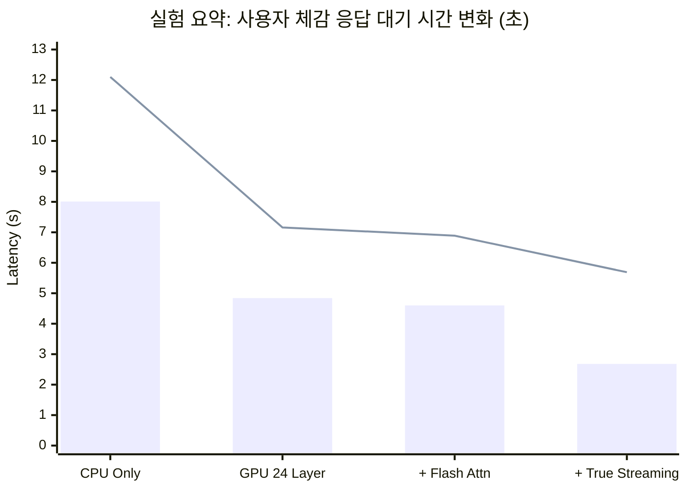

# 방구석 PC로 로컬 IoT 음성 챗봇 만들기: Omni-IoT 지연 시간(Latency) 최적화 여정


*Written by htkim*

아이언맨의 '자비스'처럼 집 안의 기기들을 음성으로 자연스럽게 제어하는 AI를 상상해 본 적 있으신가요? `omni-iot` 프로젝트는 이 상상을 현실로 만들기 위해 시작되었습니다. 목표는 클라우드 서버에 의존하지 않고, 일반 가정용 데스크톱에서 완벽하게 로컬로 동작하는 양방향(Duplex) 음성 챗봇을 구축하는 것입니다.

하지만 NVIDIA GeForce RTX 5070 Ti 16GB라는 제한된 환경에서 30B 파라미터의 거대 언어 모델(Qwen3-Omni-30B)과 음성 합성 모델(Qwen3-TTS)을 동시에 구동하는 것은 만만한 일이 아니었습니다. 이 글에서는 초기 프로젝트가 직면했던 치명적인 응답 지연(Latency) 문제를 어떻게 분석하고 해결했는지, 그 기술적 여정을 공유합니다.

---

## 1. 당면한 과제: 대화라기엔 너무 긴 침묵

초기 챗봇의 구조는 매우 정직하고 단순한 순차적(Sequential) 파이프라인이었습니다.

```text
사용자 발화 종료 → 무음 감지(VAD, 600ms) → LLM의 전체 문장 생성 완료 → TTS의 전체 음성 합성 완료 → 오디오 재생
```

이 구조는 심각한 사용자 경험 저하를 가져왔습니다. 사용자가 말을 끝내고 나서 AI의 첫 대답을 듣기까지 **무려 8초에서 12초**라는 긴 대기 시간이 발생했기 때문입니다. 이는 자연스러운 대화가 아니라 무전기 교신보다도 느린 수준이었습니다. 하드웨어를 통째로 업그레이드하지 않고 이 지연 시간을 어떻게든 대화가 가능한 수준으로 줄여야만 했습니다.

---

## 2. 병목 구간 파헤치기: 어디서부터 손대야 할까?

문제를 해결하기 위해 하드웨어 활용도, 디코딩 최적화, 그리고 시스템 아키텍처라는 세 가지 측면에서 병목을 분석했습니다.

### ① 하드웨어의 한계: VRAM과 CPU 오프로딩의 현실
가장 근본적인 원인은 절대적인 연산력과 메모리의 부족이었습니다. 30B 크기의 모델은 16GB VRAM에 모두 담기엔 너무 큽니다.

초기에는 메모리 부족으로 인해 연산의 상당 부분을 CPU에 의존했습니다. 그 결과 순수 대화(No Tool) 시 **8.01초**, IoT 기기 제어 등 툴을 사용할 때(Tool Use)는 **12.10초**라는 절망적인 속도가 나왔습니다.

이를 해결하기 위해 모델의 트랜스포머 레이어 24개를 GPU로 오프로딩(Offloading)했습니다. 결과는 즉각적이었습니다.
- **순수 대화 (No Tool)**: 8.01초 → **4.84초**
- **툴 사용 (Tool Use)**: 12.10초 → **7.16초**

*왜 48개 레이어 중 24개만 올렸을까요?* 모델 전체를 올리려면 약 22.5GB의 VRAM이 필요합니다. 16GB 그래픽카드 환경에서 TTS 모델과 멀티모달 프로젝션 모듈까지 띄워둔 채로 28개의 레이어를 올리자 즉시 메모리 부족(OOM) 에러가 발생했습니다. 즉, **24레이어 오프로딩은 현재 하드웨어가 버틸 수 있는 최적의 타협점**이었습니다.

### ② Flash Attention의 함정: 만능키는 없다
최신 LLM 추론 환경에서 속도가 느리다고 하면 흔히 듣는 조언이 있습니다. *"Flash Attention 켰어?"*
당연히 24레이어 오프로딩 상태에서 Flash Attention을 활성화해 보았습니다. 하지만 결과는 기대에 미치지 못했습니다.
- **순수 대화 (No Tool)**: 4.84초 → 4.60초 (약 5.0% 단축)
- **툴 사용 (Tool Use)**: 7.16초 → 6.89초 (약 3.7% 단축)

혹시 AI의 대답 길이가 너무 짧아서(최대 64토큰) 효과를 못 본 걸까요? 아닙니다. 진짜 이유는 우리의 실행 환경에 있습니다.
현재 환경은 컨텍스트가 짧고, 배치 사이즈가 1이며, 결정적으로 **'부분 GPU 오프로딩'** 상태입니다. 레이어가 CPU와 GPU로 나뉘어 있다 보니 PCIe 버스를 통해 데이터를 주고받는 데 발생하는 오버헤드와 CPU 자체의 연산 병목이 워낙 커서, Flash Attention이 가져다주는 알고리즘적 이득이 그 틈바구니에 묻혀버린 것입니다. Flash Attention은 좋은 최적화 도구지만, 이 특정 환경에서는 수 초 단위의 지연을 해결할 마법의 탄환이 될 수 없었습니다.

### ③ 아키텍처의 혁신: True Streaming 도입
결국 가장 극적인 변화는 모델 내부가 아니라 데이터를 다루는 '파이프라인 아키텍처'에서 일어났습니다.

기존의 순차적 구조에서는 LLM이 열심히 글을 쓰는 동안 TTS 엔진은 아무 일도 하지 않고 기다려야만 했습니다. 우리는 이 낭비를 없애기 위해 **True Streaming** 구조를 도입했습니다.

1. LLM이 생성해 내는 텍스트를 실시간 이벤트(SSE)로 받아옵니다.
2. 이 텍스트 조각(Chunk)들을 버퍼에 담아 곧바로 TTS 엔진에 주입합니다.
3. TTS가 문장 전체가 아닌, 첫 번째 오디오 조각(PCM)을 합성해 내는 즉시 재생을 시작합니다.

텍스트 생성과 음성 합성을 완전히 병렬화한 것입니다. 사용자가 발화를 마친 후 첫 음성이 출력되기까지의 시간(600ms 무음 대기 시간 포함)을 다시 측정했습니다.

결과는 놀라웠습니다.
- **순수 대화 (No Tool)**: 4.60초 → **2.68초**
- **툴 사용 (Tool Use)**: 6.89초 → **5.69초**


*(막대그래프: 순수 대화 / 선그래프: 툴 사용. 스트리밍 미적용 구간은 전체 생성 완료 시간 기준, 스트리밍 적용 구간은 첫 오디오 출력 시간 기준입니다.)*

---

## 3. 결론 및 향후 과제

가정용 데스크톱 한 대에서 양방향 로컬 IoT 챗봇을 구축하는 것은 결국 '제한된 자원과의 줄다리기'였습니다. 이번 최적화 여정을 통해 얻은 교훈은 다음과 같습니다.

1. **메모리 한계를 인지한 오프로딩**: GPU 오프로딩이 가장 극적인 속도 향상을 가져오지만, VRAM이라는 명확한 한계가 존재합니다. TTS 등 다른 모델과 공존해야 하므로 VRAM 여유 공간을 정확히 프로파일링해야 합니다.
2. **알고리즘보다 아키텍처가 우선**: Flash Attention 같은 최적화 기술도 훌륭하지만, 애초에 프로세스가 멈춰서 기다리는(Blocking) 구조라면 체감 속도는 개선되지 않습니다. 진정한 실시간 대화를 원한다면 스트리밍(True Streaming) 파이프라인 설계가 필수적입니다.
3. **무거운 툴 사용(Tool Use)**: 툴을 사용하여 기기를 제어하는 과정은 모델이 여러 번의 추론 라운드를 거쳐야 하므로 기본적으로 더 높은 지연 시간을 요구합니다.

불가능해 보였던 12초의 대기 시간이 이제는 **2초대**로 줄어들었습니다. 아직 완벽한 실시간이라고 하긴 어려울 수 있지만, 충분히 자연스러운 대화가 가능한 수준까지 시스템을 끌어올렸다는 점에서 의미 있는 진전이었습니다. 앞으로는 브라우저와 오디오 재생단(AudioWorklet)에서의 미세한 지연 시간까지 잡아내는 것이 다음 목표입니다.
