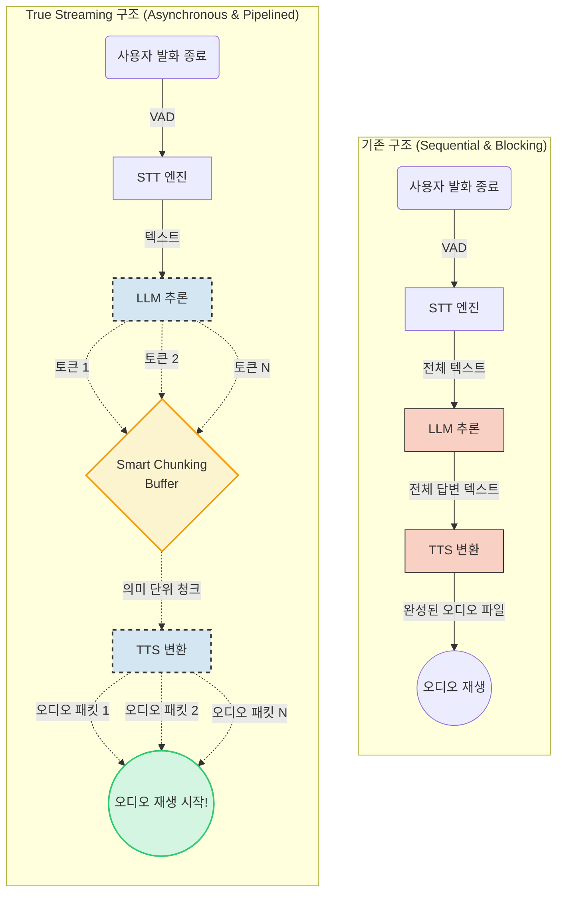

# [Omni-IoT] 방구석 PC로 로컬 IoT 음성 챗봇 만들기: V2V Latency 최적화


*Written by htkim*

아이언맨의 '자비스'처럼 집 안의 기기들을 음성으로 자연스럽게 제어하는 AI를 상상해 본 적 있으신가요? [`omni-iot`](https://github.com/htkim27/omni-iot) 프로젝트는 이 상상을 현실로 만들기 위해 시작되었습니다. 목표는 클라우드 서버에 의존하지 않고, 일반 가정용 데스크톱에서 완벽하게 로컬로 동작하는 양방향(Duplex) 음성 챗봇을 구축하는 것입니다.

이번 포스트에서는 16GB VRAM의 제한된 환경에서 프로젝트가 직면했던 V2V Latency 문제를 어떻게 분석하고 해결했는지 공유합니다.

> 💡 **Voice-to-Voice Latency (V2V Latency)**
> 유저의 발화가 멈춘 순간부터 챗봇의 첫 음성이 사용자 스피커로 출력되기 시작할 때까지의 전체 시간을 일컫는다.
>
> **※ 참고: VAD End-of-Speech 대기 시간 (600ms)**
> 측정된 V2V Latency에는 사용자가 말을 완전히 끝냈는지 확정하기 위해 무음을 기다리는 **VAD 대기 시간(현재 600ms)**이 포함되어 있습니다. 이는 단순한 시스템 연산 지연이 아니라 자연스러운 대화 턴(Turn) 교체를 위해 의도적으로 부여된 필수 대기 시간이므로 측정 시간에서 제외하지 않고 그대로 포함했습니다.

---

## 1. 당면한 과제: 대화라기엔 너무 긴 침묵

Omni-IoT 챗봇의 구조는 아래와 같이 순차적(Sequential) 파이프라인을 따르고 있습니다.

```text
사용자 발화 종료 → 무음 감지(VAD, 600ms) → Omni모델(STT + Tool Use) → TTS → 오디오 재생
```

처음 파이프라인을 완성하고 코드를 돌렸을 때 생각보다 너무 느려서 당황했습니다. 사용자가 말을 끝내고 AI의 첫 대답을 듣기까지 **무려 8초에서 12초**라는 긴 대기 시간이 발생했기 때문입니다. 그래서 어떤 부분들을 놓쳤는지, 그리고 어떤 부분들을 개선해야 할지 몇 가지 확인해 보았습니다.

---

## 2. 병목 구간 파헤치기: 어디서부터 손대야 할까?

문제를 해결하기 위해 하드웨어 활용도, 디코딩 최적화, 그리고 시스템 아키텍처라는 세 가지 측면에서 병목을 분석했습니다.

### ① 하드웨어의 한계: VRAM과 CPU 오프로딩의 현실

가장 먼저 확인한 것은 하드웨어 리소스 활용 여부였습니다. 백본(Backbone)으로 사용한 Omni 모델은 일반 데스크톱 환경에서도 CPU 오프로딩 등을 효율적으로 지원하는 `llama.cpp`기반 서버를 활용하고 있습니다. 그런데 설정을 확인해 보니, 처음 파이프라인을 돌렸을 때는 **GPU에 모델 레이어를 단 하나도 올리지 않은 실수**를 범했었다는 것을 깨달았습니다.

이처럼 연산을 100% CPU에 의존했던 초기 상태에서는 순수 대화(No Tool) 시 **8.01초**, IoT 기기 제어 등 Tool을 사용할 때는 **12.10초**라는 절망적인 속도가 나올 수밖에 없었습니다.

이를 해결하기 위해 가능한 한 많은 레이어를 GPU로 오프로딩(Offloading)하기로 했습니다. 하지만 16GB VRAM 환경에서 모델을 통째로 올릴 수는 없었습니다. 파이프라인 동작을 위해 TTS 모델 구동과 멀티턴 챗을 위한 컨텍스트 유지 명목으로 **약 2~4GB의 VRAM 여유 공간**을 남겨두어야 했기 때문입니다.

테스트 결과, 에러 없이 안정적으로 구동 가능한 최대 VRAM 활용 구간은 전체 48개 레이어의 절반인 **24개 레이어**까지였습니다. 이렇게 GPU 연산 비율을 최대로 높이자 성능은 극적으로 향상되었습니다.

- **순수 대화 (No Tool)**: 8.01초 → **4.84초** (약 39.6% 단축)
- **Tool Use**: 12.10초 → **7.16초** (약 40.8% 단축)

만약 로컬 모델을 구동할 때 연산 속도가 생각보다 너무 느리게 나온다면, 가장 먼저 **실제 GPU 연산이 의도한 대로 잘 이루어지고 있는지 모니터링**해 보시기를 권장합니다. 그리고 주어진 시스템 자원 내에서 VRAM을 어느 정도까지 안정적으로 활용할 수 있는지 직접 테스트하며 최적화하는 과정을 거쳐 보시길 바랍니다.

### ② Flash Attention의 함정: 만능키는 없다
최신 LLM 추론 환경에서 속도가 느리다고 하면 흔히 듣는 조언이 있습니다. *"추론 최적화 옵션 켰어?"*

> 💡 **Flash Attention 이란?**
> 어텐션(Attention) 연산 시 발생하는 고대역폭 메모리(HBM)와 SRAM 사이의 I/O 읽기·쓰기 병목을 줄여, 연산 속도를 대폭 높이고 메모리 사용량을 줄여주는 대표적인 알고리즘 최적화 기법입니다.

마침 `llama.cpp` 환경에서 플래그 하나로 손쉽게 켤 수 있는 대표적인 추론 최적화 옵션이었기에, 24개 레이어를 GPU에 오프로딩한 상태에서 곧바로 적용해 보았습니다. 하지만 개선 효과는 크지 않았습니다.
- **순수 대화 (No Tool)**: 4.84초 → 4.60초 (약 5.0% 단축)
- **Tool Use**: 7.16초 → 6.89초 (약 3.7% 단축)

진짜 이유는 시스템 병목의 구조적 본질에 있습니다. 이번 환경은 모델을 CPU와 GPU로 쪼갠 '부분 오프로딩' 상태였기에, PCIe 데이터 전송 오버헤드와 느린 시스템 메모리(DDR) 대역폭이 전체 지연 시간의 대부분을 지배하고 있었습니다. 결국 GPU 어텐션 연산을 아무리 쥐어짜더라도 통신·CPU 병목에 묻혀버려, 체감되는 V2V 지연(Turn-Taking Latency) 효과가 크지 않았습니다.

따라서 유명한 최적화 옵션을 무작정 켜기보다는, 각 기술의 **동작 메커니즘을 정확히 이해**하고 현재 시스템의 '진짜 병목'에 실질적인 도움이 되는지 면밀히 검토한 뒤 도입하시기를 권장 드립니다.

### ③ 아키텍처의 혁신: True Streaming 도입
결국 가장 극적인 성능 개선은 단일 모델의 연산을 쥐어짜는 것이 아니라, 데이터가 흐르는 '파이프라인 아키텍처의 패러다임 전환'에서 나왔습니다.

기존의 순차적 구조에서는 Omni모델이 사용자에게 답변해야할 글을 열심히 쓰는 동안 TTS 엔진은 아무 일도 하지 않고 기다려야만 했습니다. (Blocking 구조)
이 낭비를 제거하기 위해 생성과 TTS를 시간 축에서 겹쳐서 실행하는 **True Streaming** 구조를 도입해보았습니다.



**1. 토큰 스트리밍과 지능형 문맥 버퍼링 (Smart Chunking)**
- LLM이 생성하는 개별 토큰을 SSE(Server-Sent Events)로 실시간 수신합니다.
- 단, 단어 하나 단위로 TTS에 넘기면 음성의 억양(Prosody)과 호흡이 무너집니다. 따라서 쉼표(,), 마침표(.), 접속사 등 자연스러운 끊어 읽기 단위를 감지하는 경량 문장 버퍼를 두어, 첫 번째 '유의미한 어절/구(Phrase)'가 완성되는 즉시 TTS 큐로 밀어 넣습니다.

**2. TTS 동시 합성 및 오디오 스트리밍 (Chunk Synthesis)**
- TTS 엔진 역시 전체 답변을 기다리지 않고, 큐에 들어온 첫 텍스트 청크를 받아 즉시 첫 번째 오디오 패킷(PCM/Opus)을 스트리밍 형태로 밀어냅니다.

**3. 선점형 오디오 재생 (Immediate Playback)**
- 클라이언트는 전체 음성 파일이 완성되길 기다리지 않고, 첫 오디오 청크가 수신되는 즉시 재생을 시작합니다.
- 유저가 첫 음성을 듣는 동안 백그라운드에서는 LLM이 뒷문장을 만들고, TTS는 다음 청크를 합성하는 완전한 병렬 파이프라이닝이 이루어집니다.


결과는 놀라웠습니다.
- **순수 대화 (No Tool)**: 4.60초 → **2.68초** (약 41.7% 단축)
- **Tool Use**: 6.89초 → **5.69초** (약 17.4% 단축)

아키텍처 개편만으로 체감 대기 시간을 줄여내면서 깨달은 점이 있습니다. 바로 개별 모델 하나하나의 연산 최적화에 신경 쓰는 것도 중요하지만, 실제 AI 시스템을 구축할 때는 연결되는 모델들 그리고 그 주위를 이루고 있는'AI 하네스(Harness)'라고 불리는 요소들이 서로 **데이터를 병목 없이 효율적으로 주고받을 수 있도록 전체적인 아키텍처 디자인을 최적화**하는 고민이 반드시 수반되어야 한다는 것입니다.
---

## 3. 결론 및 향후 과제


*(파란색 막대: 순수 대화만 / 주황색 막대: Tool Use. 스트리밍 미적용 구간은 전체 생성 완료 시간 기준, 스트리밍 적용 구간은 첫 오디오 출력 시간 기준)*

가정용 데스크톱 한 대에서 양방향 로컬 IoT 챗봇을 구축하는 과정은 결국 '제한된 자원을 최적화하는 다양한 방법을 탐구하는 과정'이었습니다.

1. **메모리 예산을 고려한 타협적 오프로딩**: 당연하게도 병렬 연산에 최적화된 GPU를 활용하는 것이 단일 연산 속도를 높이는 가장 확실한 방법입니다. 하지만 제한된 리소스 환경에서는 `llama.cpp`와 같은 추론 Tool을 활용해 최적의 '부분 오프로딩' 타협점을 찾아내는 정교한 프로파일링이 필요합니다.
2. **단일 연산 최적화보다 파이프라인 아키텍처가 우선**: Flash Attention 같은 최적화 알고리즘을 도입하더라도, 프로세스 간에 서로 멈춰서 기다리는(Blocking) 순차적 구조에서는 한계가 뚜렷했습니다. 체감 지연 시간을 극적으로 낮추기 위해서는 데이터를 시간 축에서 비동기적으로 겹쳐 처리하는 True Streaming 설계가 가장 필수적이고 효과적이었습니다.
3. **Tool Use 시 발생하는 필연적 오버헤드**: 외부 IoT 기기를 제어하기 위해서는 LLM이 Tool을 호출하고 결과를 파싱하는 보이지 않는 추론 루프가 사전에 돌아가야 하므로, 순수 대화보다 필연적으로 더 높은 V2V Latency가 발생함을 확인했습니다.

**🚀 향후 과제 (Next Steps)**

결과적으로 불가능해 보였던 12초의 대기 시간이 2초대로 줄어들어 자연스러운 대화가 가능한 수준이 되었지만, 아키텍처를 극한으로 최적화하기 위한 다음 목표가 남아있습니다.

바로 **Tool Use의 병렬화(Full-duplex)**입니다. 현재의 방식은 AI가 내부적으로 외부 Tool(API)을 실행할 경우, 그 작업이 완료될 때까지 사용자가 침묵 속에서 대기해야만 합니다. 그 다음 포스트에서는 관련 실험을 통해 latency를 1초대로 줄일 수 있는 지 확인해보겠습니다.

감사합니다.
